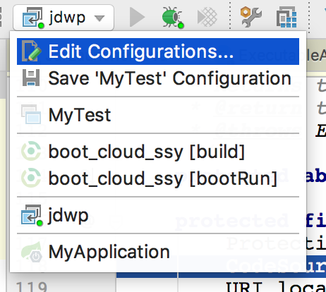
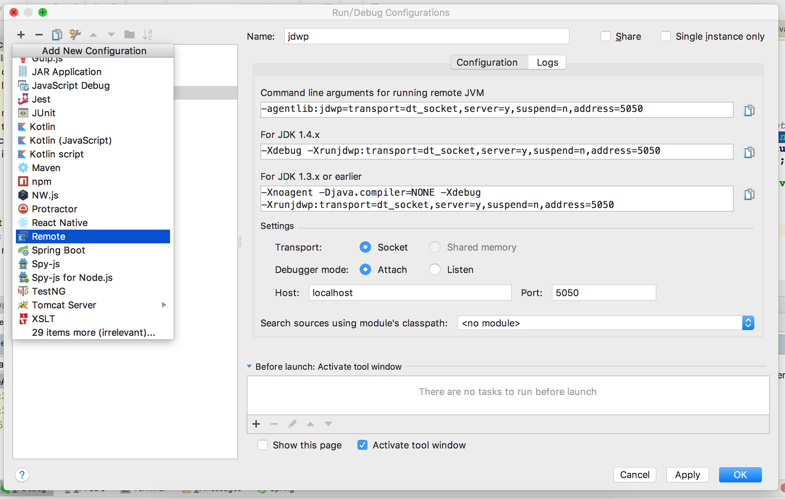
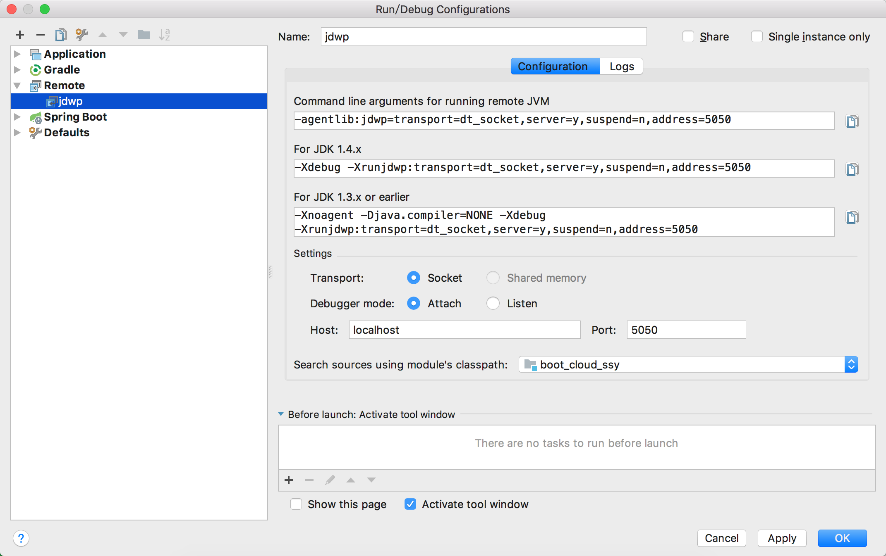

### JDWP远程调试

#### 服务端设置

> java -agentlib:jdwp=transport=dt_socket,server=y,suspend=y,address=5050 -jar boot_cloud_ssy-1.0.jar

|参数|说明|示例|
|---|---|---|
|transport|传输协议，一般都是dt_socket|transport=dt_socket|
|server|是否监听debug|服务端必须设置为y，server=y|
|suspend|启动的时候就等待客户端debug连接建立|suspend=y|
|address|监听的端口号||

#### 客户端配置

##### 1.点击Edit Configurations...

##### 2.点击+，新建remote
> transport选择Socket

> Debugger mode选择Attach

> Host: 服务端地址

> port: 服务端监听的端口号

> search sources using modules classpath: 源代码路径

