### Kafka
> Kafka是一个分布式的流式平台，

### 核心概念


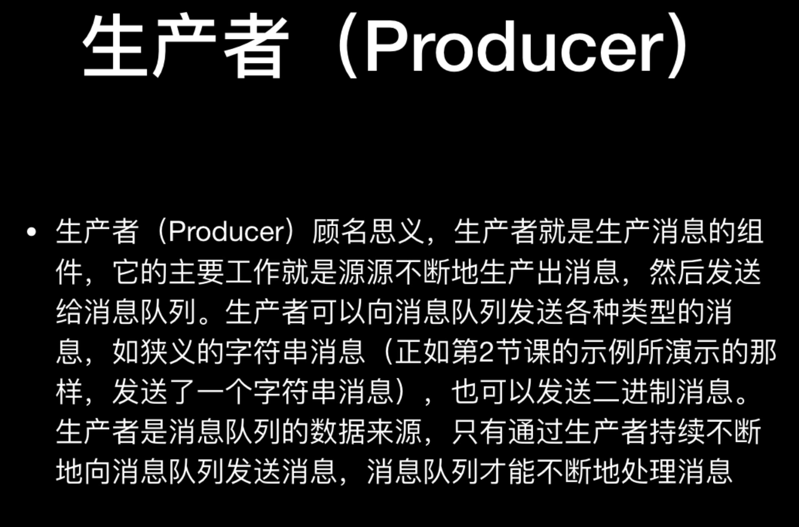
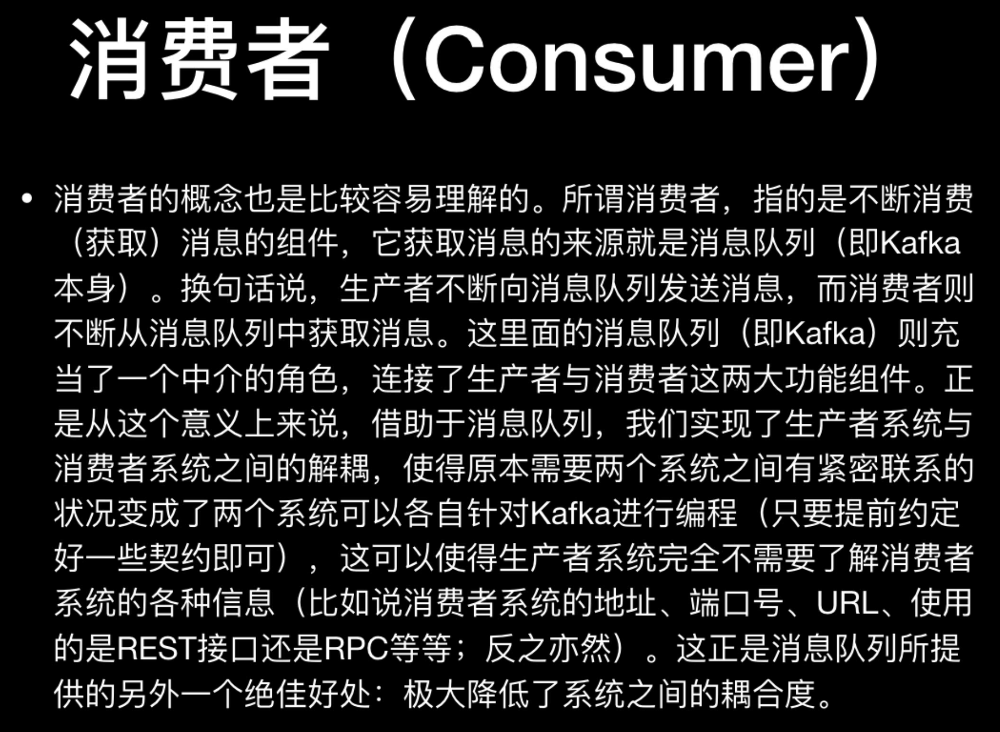
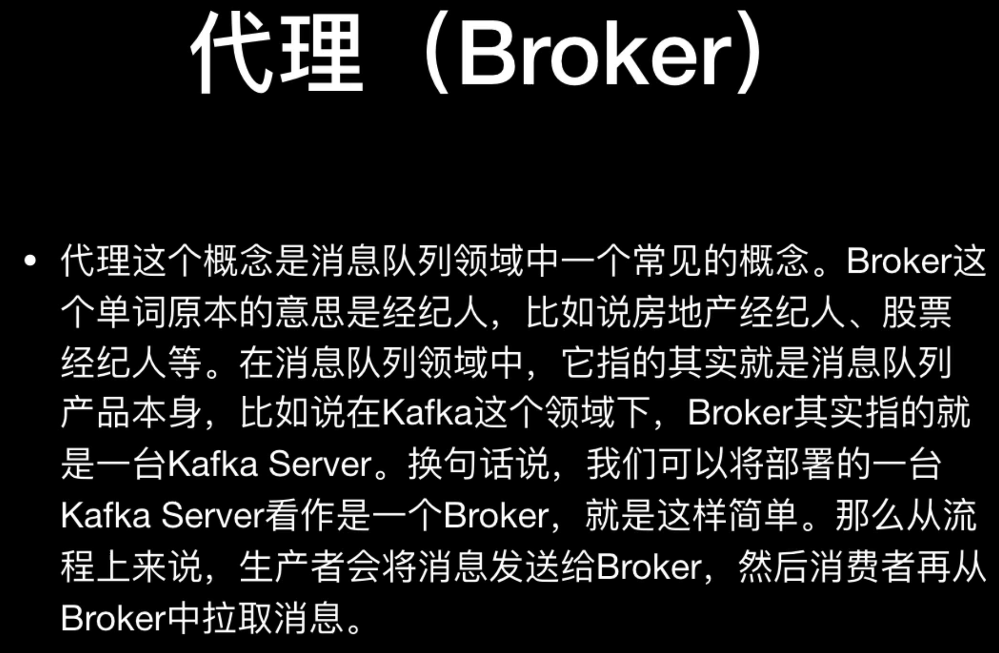
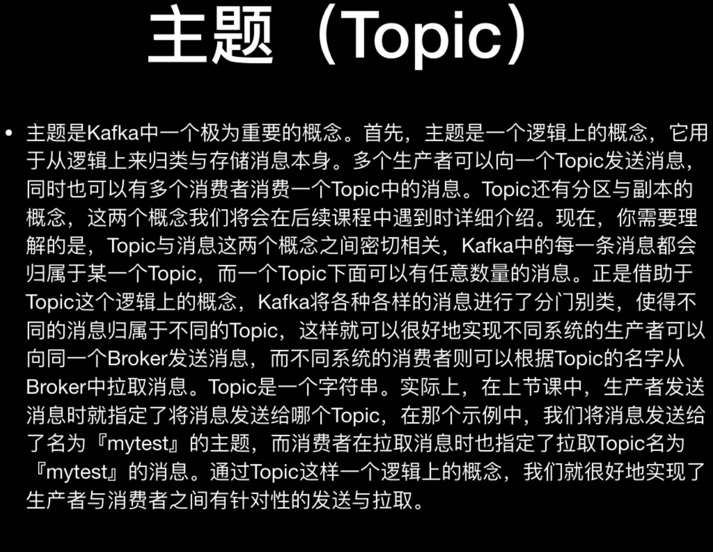
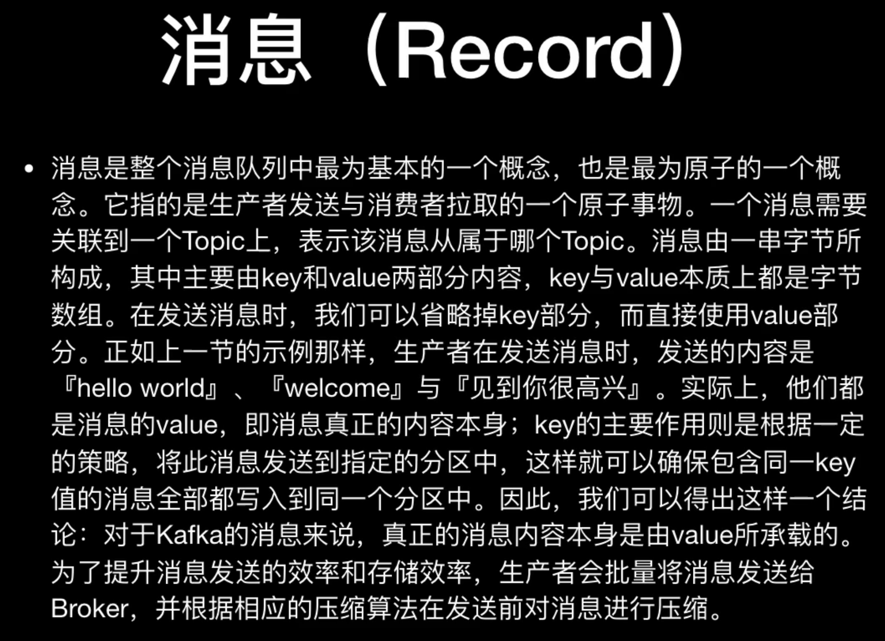
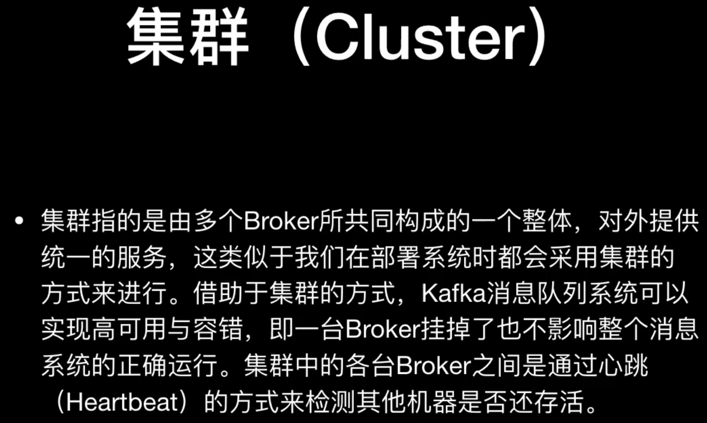
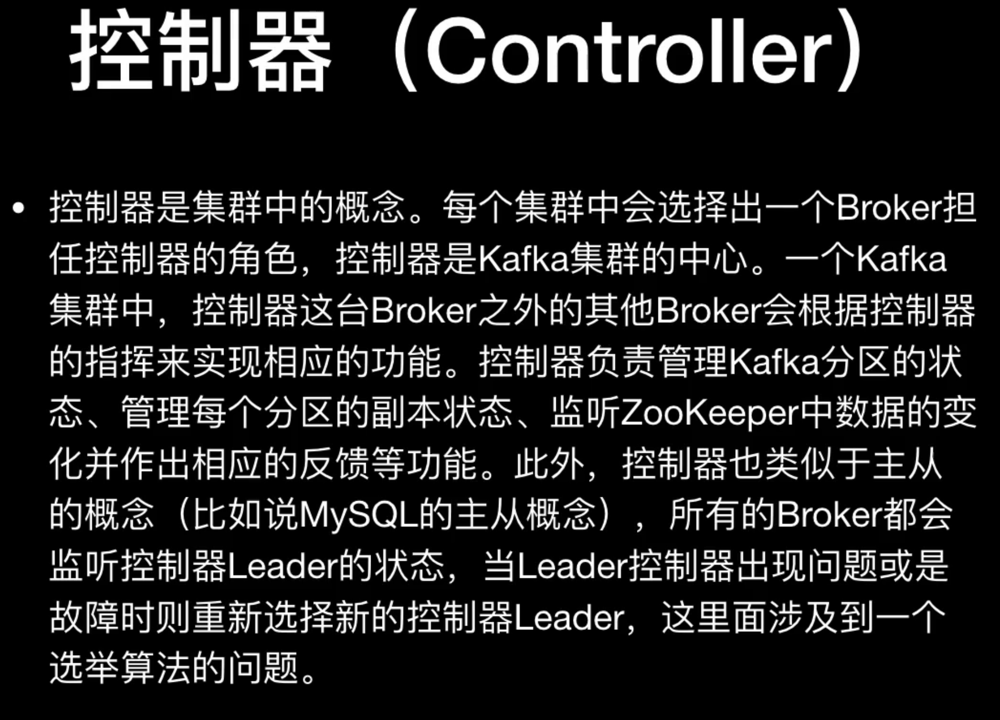
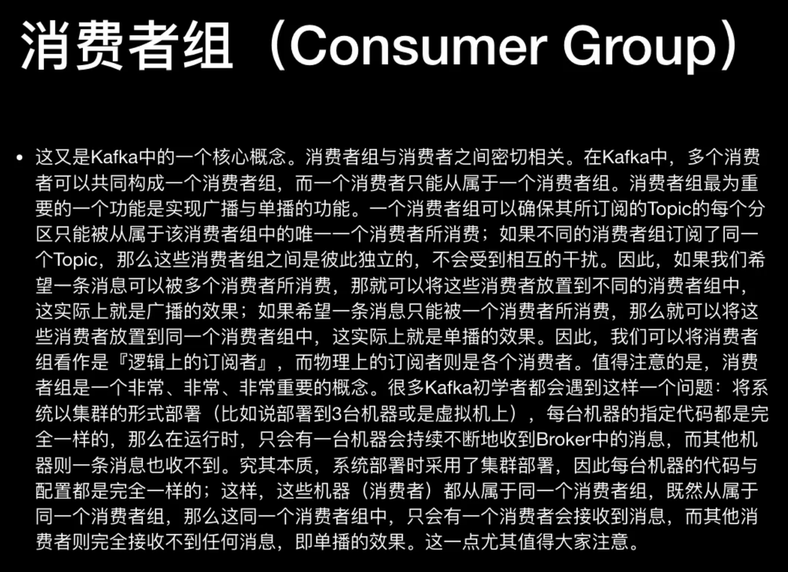


```
流式平台的三个指标：
1.发布和订阅流式记录(即消息)。
2.以一种容错的持久化方式存储流式记录。
3.当流式记录出现的时候能处理它。


重要概念：
1.Kafka是运行在一个包含一台或者多台机器的集群中的，也可以扩展到多个数据中心。
2.Kafka集群以Topic的方式分门别类的处理不同类型的消息。
3.每条消息由一个key、一个value、一个timestamp组成。


Kafka拥有四个核心API:
1.


The Producer API allows an application to publish a stream of records to one or more Kafka topics.
The Consumer API allows an application to subscribe to one or more topics and process the stream of records produced to them.
The Streams API allows an application to act as a stream processor, consuming an input stream from one or more topics and producing an output stream to one or more output topics, effectively transforming the input streams to output streams.
The Connector API allows building and running reusable producers or consumers that connect Kafka topics to existing applications or data systems. For example, a connector to a relational database might capture every change to a table.
The Admin API allows managing and inspecting topics, brokers and other Kafka objects.


Guarantees

At a high-level Kafka gives the following guarantees:

Messages sent by a producer to a particular topic partition will be appended in the order they are sent. That is, if a record M1 is sent by the same producer as a record M2, and M1 is sent first, then M1 will have a lower offset than M2 and appear earlier in the log.
A consumer instance sees records in the order they are stored in the log.
For a topic with replication factor N, we will tolerate up to N-1 server failures without losing any records committed to the log.


```

### 启动kafka自带的zookeeper

> bin/zookeeper-server-start.sh config/zookeeper.properties


### 启动kafka服务

> bin/kafka-server-start.sh  config/server.properties

### 创建主题
> bin/kafka-topics.sh --create --zookeeper localhost:2181 --replication-factor 1 --partitions 1 --topic myTopic


### 发送消息
> bin/kafka-console-producer.sh --broker-list localhost:9092 --topic myTopic


### 消费消息
> bin/kafka-console-consumer.sh --bootstrap-server localhost:9092 --topic myTopic


### 列出所有的主题
> bin/kafka-topics.sh --list --zookeeper localhost:2181 (不推荐使用)

> bin/kafka-topics.sh --list --bootstrap-server localhost:9092 (推荐使用)

### 列出指定主题的详细信息
> bin/kafka-topics.sh --describe --zookeeper localhost:2181 --topic myTopic

### kafka系统自动创建的主题：__consumer_offsets  用来记录消费者消费消息的偏移量
> __consumer_offsets 默认会有50个分区(从0到49)


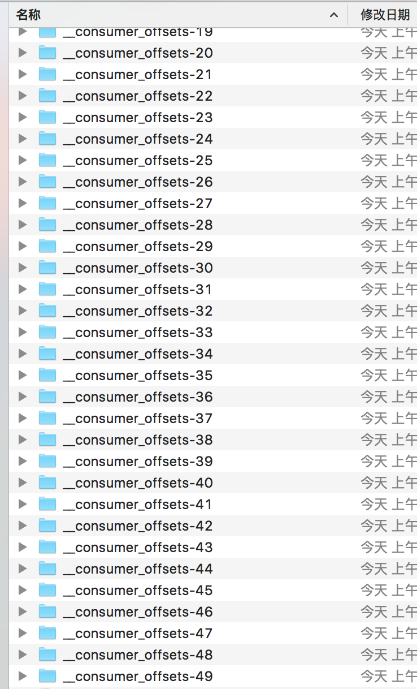

### 删除主题(不可逆的)
> bin/kafka-topics.sh --bootstrap-server localhost:9092 --delete --topic yourTopic

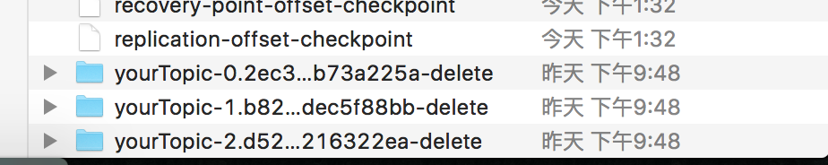

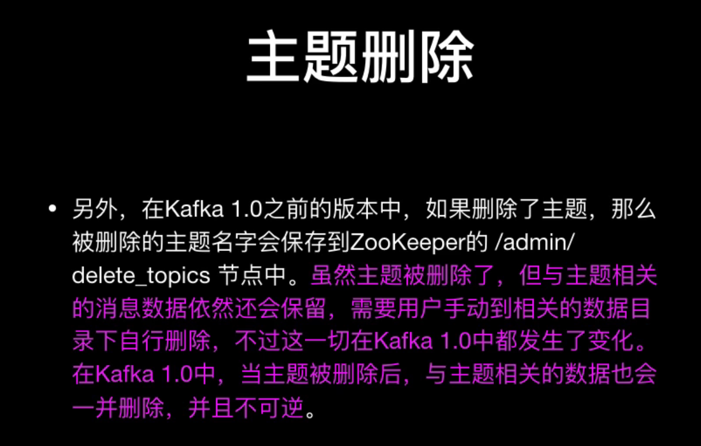


### 连接到Zookeeper

> bin/zookeeper-shell.sh localhost:2181


### 关于kafka分区:
> 1.每个分区都是一个有序、不可变的消息序列，后续新来的消息会源源不断地、持续追加到分区的后面，这相当于一种结构化的提交日志(类似于Git的提交日志)。

> 2.分区中的每一条消息都会被分配一个连续的id值(即offset), 该值用于唯一标识分区中的每一条消息。

### 分区的重要作用：
> 1.分区中的消息数据是存储在日志文件中的，而且同一个分区中的消息数据是按照发送顺序严格有序的。分区在逻辑上对应一个日志，当生产者将消息写入分区中
> 时，实际上是写到了分区所对应的日志当中。而日志可以看作是一种逻辑上的概念，它对应于磁盘上的一个目录。一个日志文件由多个segment(段)来构成，每个
> segment对应于一个索引文件与一个日志文件。

> 2.借助于分区，我们可以实现Kafka Server的水平扩展。对于一台机器来说，无论是物理机还是虚拟机，其运行能力总归是有限的。当一台机器达到其能力上限时
> 就无法再扩展了，即垂直扩展能力总是受到硬件制约的。通过使用分区，我们可以将一个主题中的消息分散到不同的Kafka Server上(这里需要使用kafka集群)，
> 这样当机器的能力不足时，我们只需要添加机器就可以了，在新的机器上创建新的分区，这样理论上就可以实现无限的水平扩展能力。

> 3.分区还可以实现并发处理能力，向一个主题所发送的消息会发送给该主题所拥有的不同的分区中，这样消息就可以实现并行发送和处理，由多个分区来接收所发送的消息。


### Segment(段)

> 一个分区(partition)是由一系列有序、不可变的消息所构成的。一个partition中的消息数量可能会非常多，因此显然不可能将所有消息都保存到一个文件当中。因
> 此，类似于log4j的rolling log，当partition中的消息数量增长到一定程度之后，消息文件就会进行切割，新的消息会被写到一个新的文件当中，当新的文件增长到
> 一定程度后，新的消息又会被写到另一个新的文件当中，以此类推；这一个个新的数据文件我们就称之为Segment(段)。

> 因此，一个partition在物理上是由一个或者多个Segment所构成的。每个Segment中则保存了真实的消息数据。


### 关于partition与segment之间的关系:
> 1.每个partition都相当于一个大型文件系统被分配到多个大小相等的segment数据文件中，每个segment中的消息数量未必相等(这与消息大小有着紧密的关系，
> 不同的消息所占据的磁盘空间显然不一样的)，这个特点使得老的segment文件可以很容易就被删除掉，有助于提升磁盘的利用效率。

> 2.每个partition只需要支持顺序读写即可，segment文件的生命周期是由Kafka Server的配置参数所决定的。比如说，server.properties文件
> 中的参数项log.retention.hours=168就表示7天后删除老的消息文件。


### 关于分区目录中的4个文件的含义与作用:

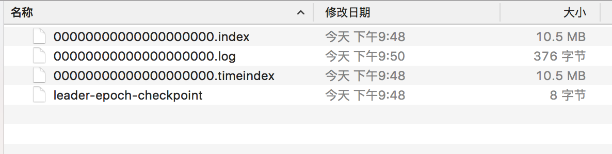

> 1.00000000000000000000.index: 它是segment文件的索引文件，它与接下来我们要介绍的00000000000000000000.log数据文件是成对出现的。后缀.index
> 就表示这是个索引文件。

> 2.00000000000000000000.log: 它是segment文件的数据文件，用于存储实际的消息。该文件是二进制格式的。segment文件的命名规则是partition全局的
> 第一个segment从0开始，后缀每个segment文件名为上一个segment文件最后一条消息的offset值。没有数字则用0填充。由于这里的主题消息数据量较少，因此只有一个
> 数据文件。

> 3.00000000000000000000.timeindex：该文件是一个基于消息日期的索引文件，主要用途是在一些根据日期或是时间来寻找消息的场景下使用，此外在基于时间的日志
> roolling或者基于时间的日志保留策略等情况下也会使用。实际上，该文件是在Kafka较新版本中才增加的，老版本kafka是没有该文件的，它是对*.index文件的一个有益补充
> 。*.index文件是基于偏移量的索引文件，而 *.timeindex则是基于时间戳的索引文件。

> 4.leader-epoch-checkpoint: 是leader的一个缓存文件。实际上，它是与kafka的HW(High Water)与LEO(Log End Offset)相关的一个重要文件。


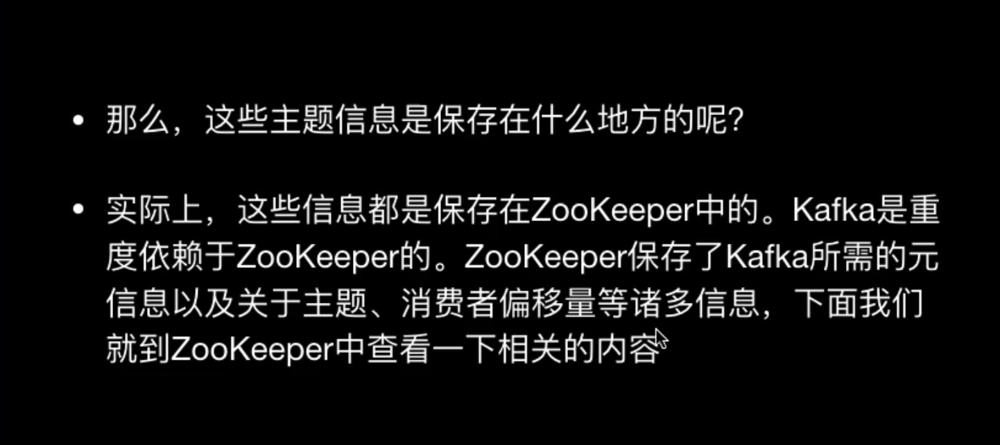


