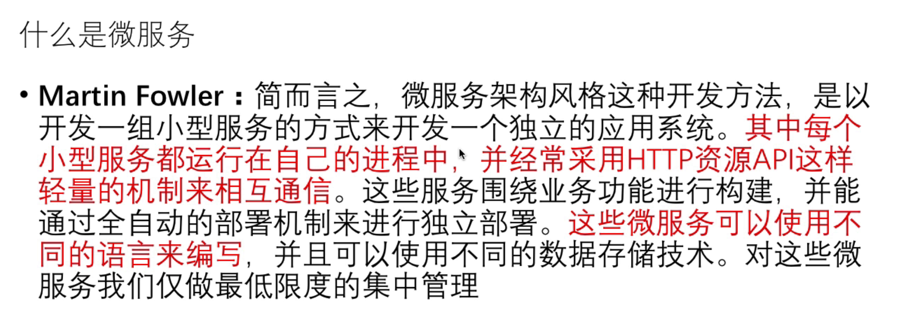
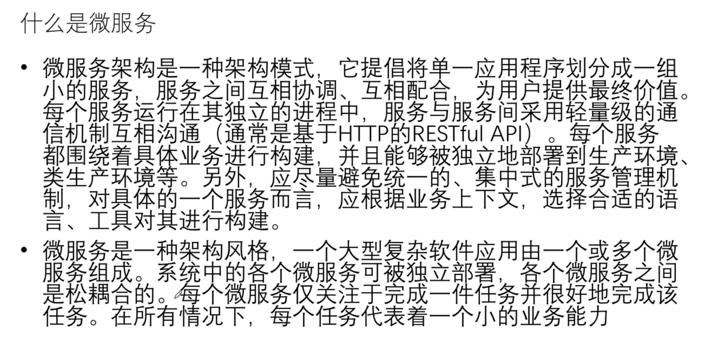
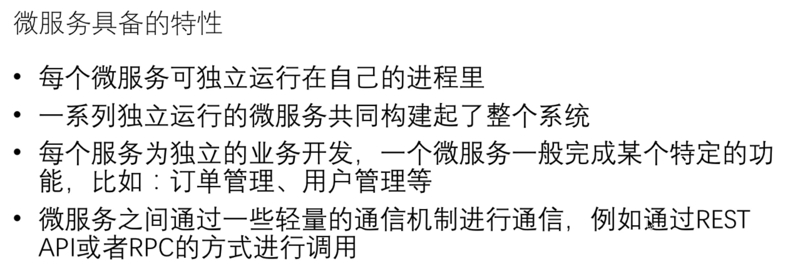
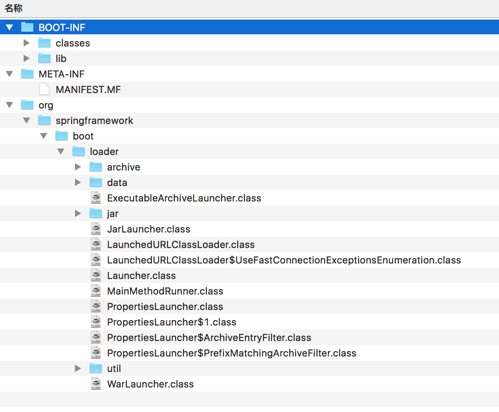
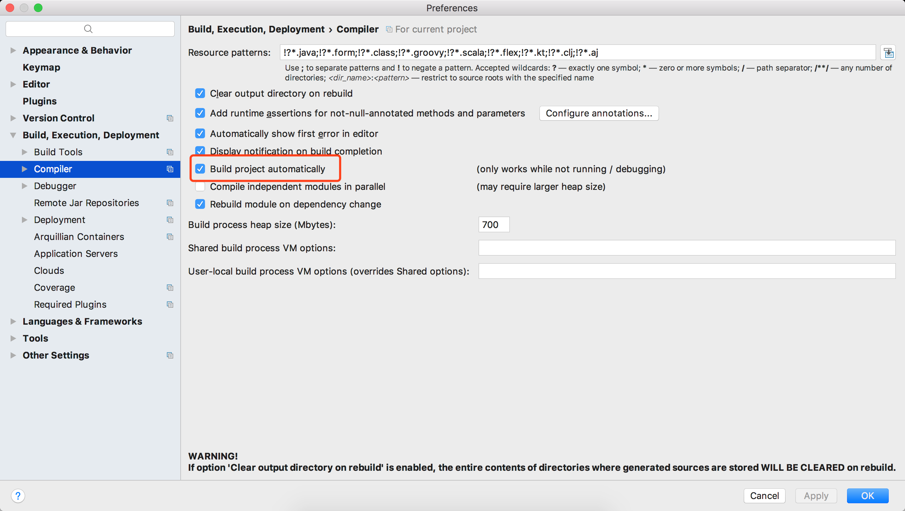
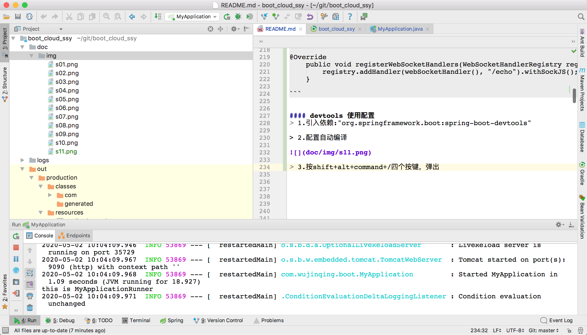
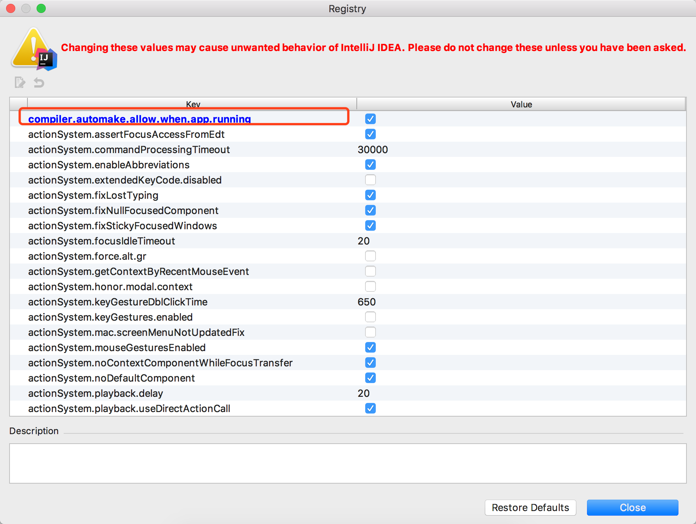

## Spring Boot & Cloud

### 什么是微服务







### spring boot 提供了两种类型的配置文件形式
> 1.properties文件形式。

> 2.yml文件形式(推荐)。


### boot jar包结构



### @Value 获取配置文件里面的配置信息
> @Value("${myConfig.myObject.myName}")


### 获取环境变量信息org.springframework.core.env.Environment

```
org.springframework.core.env.Environment

@Configuration
   public class AppConfig {

       @Autowired Environment env;

       @Bean
       public MyBean myBean() {
           MyBean myBean = new MyBean();
           myBean.setName(env.getProperty("bean.name"));
           return myBean;
       }
   }

Environment还可以使用@PropertySource里面的东西

@Configuration
   @PropertySource("classpath:/com/acme/app.properties")
   public class AppConfig {

       @Inject Environment env;

       @Bean
       public MyBean myBean() {
           return new MyBean(env.getProperty("bean.name"));
       }
   }

@Value可以使用@PropertySource里面的东西

@Configuration
   @PropertySource("classpath:/com/acme/app.properties")
   public class AppConfig {

       @Value("${bean.name}") String beanName;

       @Bean
       public MyBean myBean() {
           return new MyBean(beanName);
       }
   }


```

### @Import导入配置，组合配置

```
@Configuration
   public class DatabaseConfig {

       @Bean
       public DataSource dataSource() {
           // instantiate, configure and return DataSource
       }
   }

   @Configuration
   @Import(DatabaseConfig.class)
   public class AppConfig {

       private final DatabaseConfig dataConfig;

       public AppConfig(DatabaseConfig dataConfig) {
           this.dataConfig = dataConfig;
       }

       @Bean
       public MyBean myBean() {
           // reference the dataSource() bean method
           return new MyBean(dataConfig.dataSource());
       }
   }
```

### @Profile 指定激活哪个环境的配置文件，如果使用了Apollo这个东西就没用了

```
@Profile("development")
   @Configuration
   public class EmbeddedDatabaseConfig {

       @Bean
       public DataSource dataSource() {
           // instantiate, configure and return embedded DataSource
       }
   }

   @Profile("production")
   @Configuration
   public class ProductionDatabaseConfig {

       @Bean
       public DataSource dataSource() {
           // instantiate, configure and return production DataSource
       }
   }


或者


@Configuration
   public class ProfileDatabaseConfig {

       @Bean("dataSource")
       @Profile("development")
       public DataSource embeddedDatabase() { ... }

       @Bean("dataSource")
       @Profile("production")
       public DataSource productionDatabase() { ... }
   }

```

### @SpringBootApplication 注解包含：@SpringBootConfiguration，@EnableAutoConfiguration，@ComponentScan 三个注解。


### @EnableAutoConfiguration
> Enable auto-configuration of the Spring Application Context, attempting to guess and configure beans that you are likely to need. Auto-configuration classes are usually applied based on your classpath and what beans you have defined.

> You can always manually exclude() any configuration that you never want to apply (use excludeName() if you don't have access to them). You can also exclude them via the spring.autoconfigure.exclude property.

>  It is generally recommended that you place @EnableAutoConfiguration (if you're not using @SpringBootApplication) in a root package so that all sub-packages and classes can be searched.


### ApplicationContext 最核心的接口
> 它是给整个应用提供配置的中央接口，当程序在运行时它是只读的，但是也可以重新加载如果实现类支持的话。

#### ApplicationContext提供了以下功能：

> 1.提供了用于访问bean工厂的方法，该功能是通过继承ListableBeanFactory接口得到的。

> 2.提供了以统一风格的方式加载文件资源的能力，该功能是通过继承ResourceLoader接口得到的。

> 3.提供了向已注册的监听器发布事件的能力，该功能是通过继承ApplicationEventPublisher接口得到的。

> 4.提供了支持国际化的能力，该功能是通过继承MessageSource接口得到的。

> 5.提供了从父上下文继承过来的功能。


### SpringApplicationRunListener Spring应用运行监听器
> 它是针对于SpringApplication的run方法的监听器。最终会执行SpringApplication里面的listeners(即ApplicationListener)。


#### SpringApplicationRunListener的生命周期
|生命周期方法|调用时机|对应的事件|
|---|---|---|
|starting|当run方法一启动的时候立刻执行|ApplicationStartingEvent|
|environmentPrepared|在环境已经准备好，但ApplicationContext还未被创建时调用|ApplicationEnvironmentPreparedEvent|
|contextPrepared|在ApplicationContext已经创建并准备好，但在资源被加载之前|ApplicationContextInitializedEvent|
|contextLoaded|在ApplicationContext资源被加载并且在refreshed方法调用之前|ApplicationPreparedEvent|
|started|在refreshed方法已经被调用，并且应用已经启动，但在CommandLineRunners及ApplicationRunners未被调用之前|ApplicationStartedEvent|
|running|在run方法结束之前，并且refreshed方法已经被调用，同时CommandLineRunners及ApplicationRunners也已经被调用|ApplicationReadyEvent|
|failed|当run方法执行失败|ApplicationFailedEvent|


### Environment环境
> 代表当前应用正在运行的环境。环境有两个重要组成部分: profiles和properties. Environment是在应用内部使用的，开发人员一般会通过${...}方式获取。


#### ConfigurableEnvironment
> ConfigurableEnvironment是Environment子接口，提供了设置激活的及默认的profiles的方法，并且允许你操纵底层的属性源。


### ApplicationRunner和CommandLineRunner
> 在应用启动的时候会调用该接口实现类的run方法，两个Runner接口的区别在于，对命令行参数是否进行了封装。

#### ApplicationRunner
> run(ApplicationArguments args) 命令行参数args已经被封装成ApplicationArguments对象

#### CommandLineRunner
> run(String... args) 原生的命令行参数


### WebSocket 长连接

> @EnableWebSocket

> WebSocketConfigurer

> EchoWebSocketHandler

```
@Override
    public void registerWebSocketHandlers(WebSocketHandlerRegistry registry) {
        registry.addHandler(webSocketHandler(), "/echo").withSockJS();
    }

```


#### devtools 使用配置
> 1.引入依赖:"org.springframework.boot:spring-boot-devtools"

> 2.配置自动编译



> 3.按shift+alt+command+/四个按键，弹出Maintenance框，选择Registy, 勾选上compiler.automake.allow.when.app.running.





#### devtools 热部署原理
```
org.springframework.boot.devtools.restart.classloader.RestartClassLoader


它有两个类加载器，一个用于加载第三方jar包里面的Class文件，另一个用来加载我们项目里面的Class文件。

当用来加载我们项目Class文件的类加载器监测到我们项目的Class文件发送变动时，会并且只会重新加载我们项目的Class文件。
这样被加载类大大减少。

```


