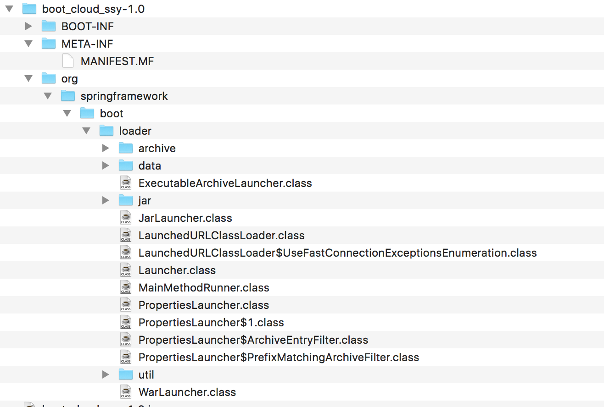
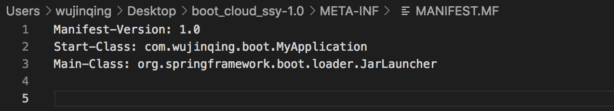
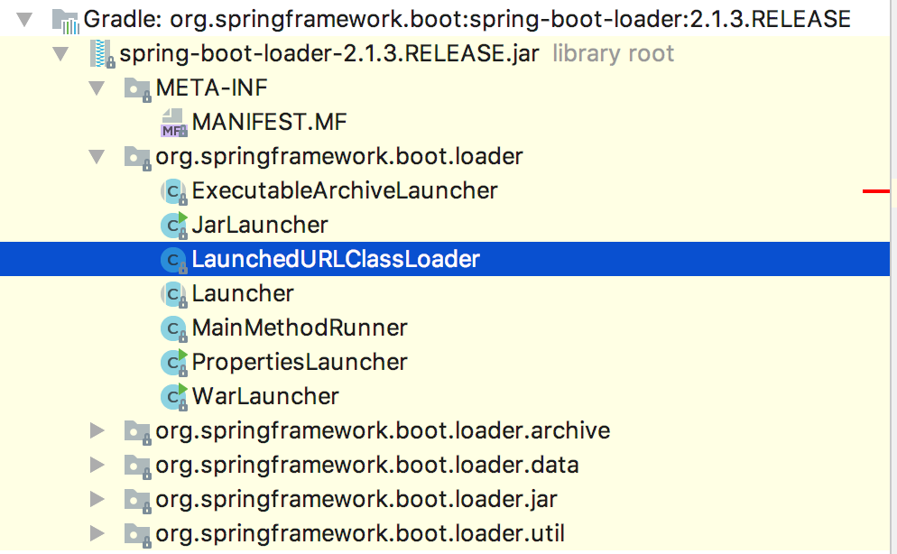

## spring boot启动原理


### jar包结构



### META-INF/MANIFEST.MF文件描述了启动类





```
Manifest-Version: 1.0
Start-Class: com.wujinqing.boot.MyApplication
Main-Class: org.springframework.boot.loader.JarLauncher

```

> 从MANIFEST.MF文件中看出启动类是org.springframework.boot.loader.JarLauncher


### 执行JarLauncher的main方法

```java
程序入口：JarLauncher.java
public static void main(String[] args) throws Exception {
        (new JarLauncher()).launch(args);
    }


获取jar包路径 Launcher.java
protected final Archive createArchive() throws Exception {
        ProtectionDomain protectionDomain = this.getClass().getProtectionDomain();
        CodeSource codeSource = protectionDomain.getCodeSource();
        URI location = codeSource != null ? codeSource.getLocation().toURI() : null;
        String path = location != null ? location.getSchemeSpecificPart() : null;
        if (path == null) {
            throw new IllegalStateException("Unable to determine code source archive");
        } else {
            File root = new File(path);
            if (!root.exists()) {
                throw new IllegalStateException("Unable to determine code source archive from " + root);
            } else {
                return (Archive)(root.isDirectory() ? new ExplodedArchive(root) : new JarFileArchive(root));
            }
        }
    }


获取应用程序真正的启动类. ExecutableArchiveLauncher.jar 即：MANIFEST.MF文件里面的Start-Class属性。

protected String getMainClass() throws Exception {
        Manifest manifest = this.archive.getManifest();
        String mainClass = null;
        if (manifest != null) {
            mainClass = manifest.getMainAttributes().getValue("Start-Class");
        }

        if (mainClass == null) {
            throw new IllegalStateException("No 'Start-Class' manifest entry specified in " + this);
        } else {
            return mainClass;
        }
    }


执行launch方法
1.会创建一个自定义类加载器LaunchedURLClassLoader来加载我们自己写的Class文件及依赖的jar包，并将它设置为线程上下文类加载器。
2.通过上面的类加载器实例化真正的启动类com.wujinqing.boot.MyApplication并执行main方法

protected void launch(String[] args) throws Exception {
        JarFile.registerUrlProtocolHandler();
        // 创建LaunchedURLClassLoader
        ClassLoader classLoader = this.createClassLoader(this.getClassPathArchives());
        this.launch(args, this.getMainClass(), classLoader);
    }


protected void launch(String[] args, String mainClass, ClassLoader classLoader) throws Exception {
        // 将LaunchedURLClassLoader设置为线程上下文类加载器
        Thread.currentThread().setContextClassLoader(classLoader);
        this.createMainMethodRunner(mainClass, args, classLoader).run();
    }


执行com.wujinqing.boot.MyApplication并执行main方法

public void run() throws Exception {
        Class<?> mainClass = Thread.currentThread().getContextClassLoader().loadClass(this.mainClassName);
        Method mainMethod = mainClass.getDeclaredMethod("main", String[].class);
        mainMethod.invoke((Object)null, this.args);
    }


```